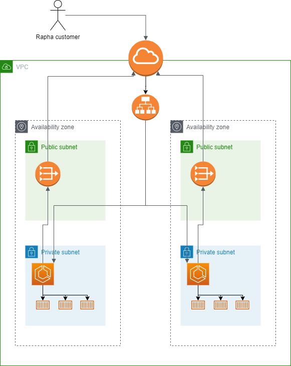

# Rapha Senior DevOps Engineer technical task

This is a Terraform repository for deploying an Apache web server to ECS Fargate in AWS.

## System Design


## Usage

First configure the remote state by instantiating the [init_tf_state](https://github.com/harry-reid94/rapha-technical-task/tree/master/terraform/init_tf_state) subdirectory:

```
terraform init
terraform plan
terraform apply
```
This creates an S3 bucket to store the state file and also a DynamoDB table for the state lock.
Then navigate to the parent directory where the main code lies and run the same Terraform commands to create the system. Output from plan:

```
Plan: 22 to add, 0 to change, 0 to destroy.

Changes to Outputs:
  + load_balancer_ip = (known after apply)
```

## Example Output

```plain
❯ curl http://lb-rapha-1073370279.eu-west-1.elb.amazonaws.com
<html><body><h1>It works!</h1></body></html>
```

## Requirements

| Name | Version |
|------|---------|
| <a name="requirement_terraform"></a> [terraform](#requirement\_terraform) | >= 0.14.7 |
| <a name="requirement_aws"></a> [aws](#requirement\_aws) | ~> 3.7.0 |
| <a name="requirement_docker"></a> [docker](#requirement\_docker) | >= 19.03.6 | 

Recommend using tfenv for Terraform version management - https://github.com/tfutils/tfenv

## Considerations
#### How could you improve the deployment, or usability?
- Go multi-region, or even multi-cloud for higher availability.
- Modularise the Terraform services for reusability.
- Configure auto-scaling.
- Have a greater pod count (increase ecs_node_count variable).
- Setup an application codebase alongside the terraform directory and have Github Actions automatically build an image and deploy to ECR after new commits.
- Implement a monitoring stack for the server.

#### What security mechanisms might we need to put into place?
- The system is already moderately secure. The containers live inside a private subnet, only accessible through the Application Load Balancer.
- The ALB and containers both only allow incoming traffic through port 80 due to the configured Security Groups.
- Can set up an SSL certificate for the server and only route traffic from port 443 into the containers.

#### How could you give visibility to the users that are accessing the webpage?
- Users can access via the load balancer URL described in the Terraform output. 
- We can configure CNAMEs in Route 53 for custom domain names.

#### How could you open up collaboration on this project?
- The project is publicly available on Github. Anyone can contribute.
